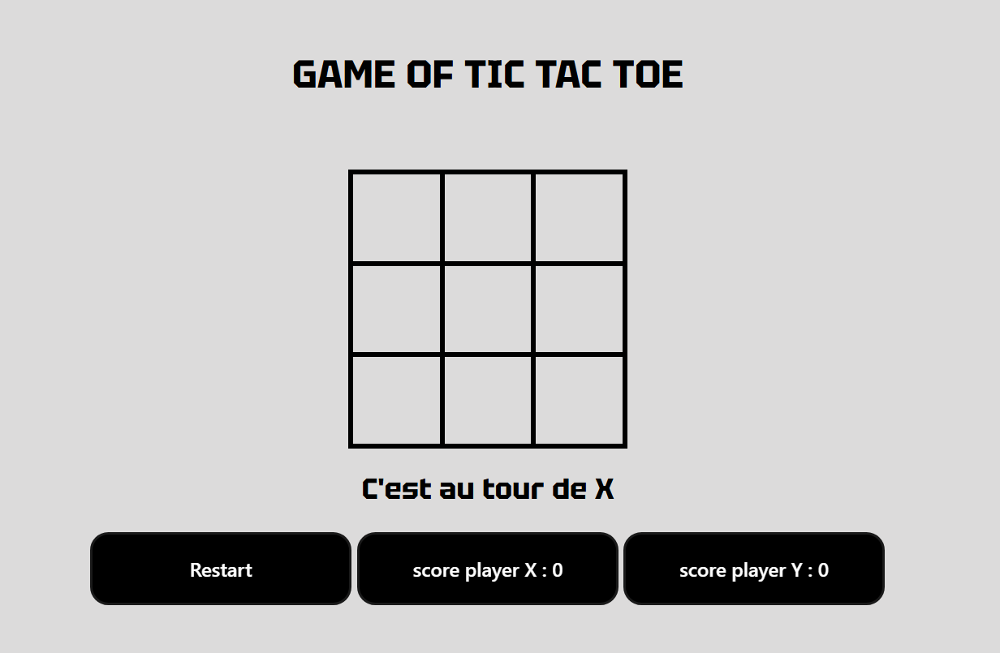
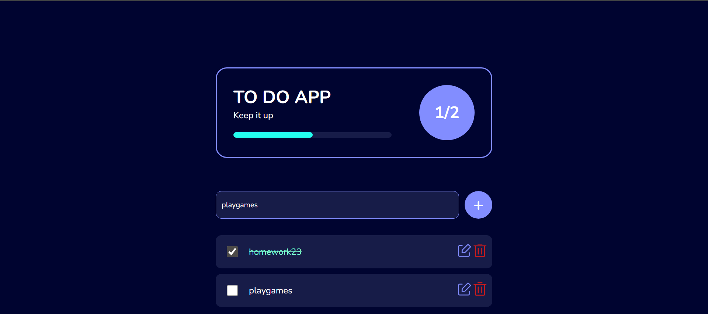
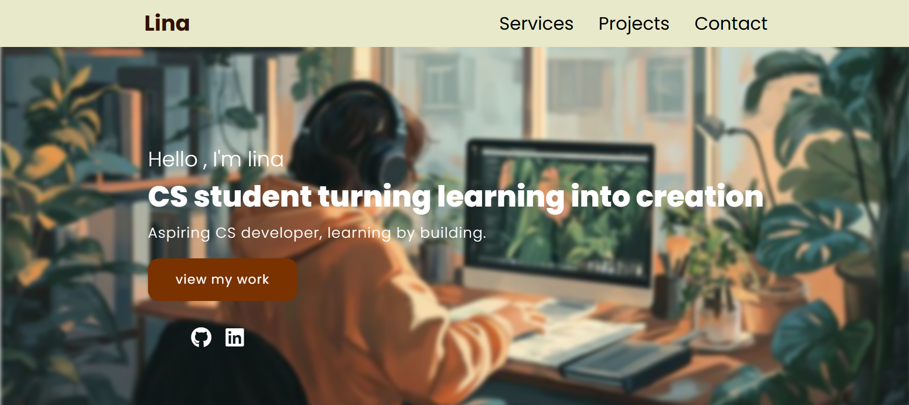
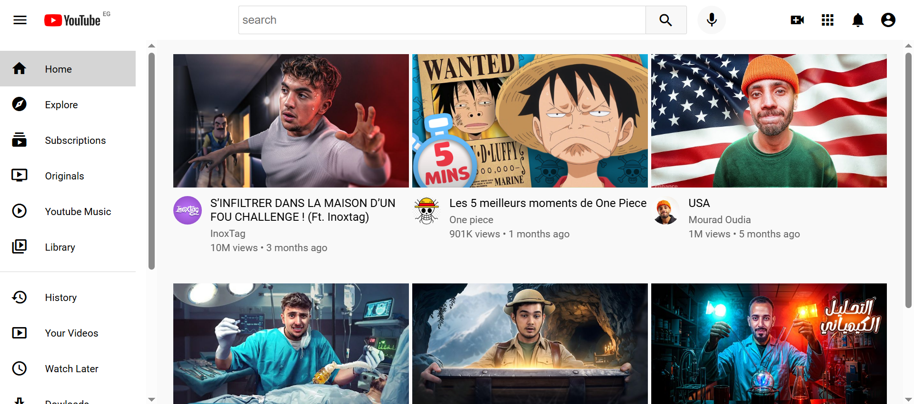

****Friendly Mini Projects****
--
Some fun and friendly projects I built while learning the basics of frontend development.

**1) XO Game**

A simple XO (Tic-Tac-Toe) game that helped me:

- Work with CSS Grid for styling
- Write responsive JavaScript code
- Handle the DOM effectively
- Understand the logic behind game interactions

A great beginner project to grasp essential JavaScript concepts.





----

**2) To-Do List**

An amazing little app that strengthened my JavaScript skills:

- Hiding and showing elements when needed
- Improving event handling and DOM manipulation
- Keeping the UI simple but functional

 
  

----
**3) Simple Portfolio**

A basic HTML & CSS portfolio that helped me:

- Style clean and responsive web pages
- Practice layout techniques
- Keep code organized and readable

  


----
**4) YouTube Interface**

This project pushed my skills further:

- Structuring a web page with semantic, well-organized divs
- Mastering Flexbox for flexible, responsive layouts
- Styling multiple elements with precision
- Following good coding practices for clean, maintainable code

 

 ----
 
 **How to Use**
 
 ```bash
You can clone this repo or download the files directly.
Any suggestions, improvements, or feedback are welcome!
```

----
© 2025 Delhoum Lina
